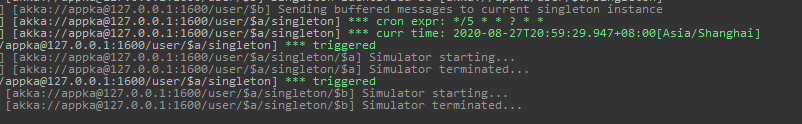

管家服务
==========

某些情况下，需要我们模拟数据进行开发测试，用于随机生成的数据进行密集的数据处理；另外一种情况需要我们提供一个“管家”或“机器人”的概念，帮助我们自动化处理数据。这个“管家”被赋予的“定时任务”、“AI智能”的本领。

这点好处自然是，帮我们及早发现问题；模拟生成环境...

## 基础建设

1. SBT 1.3.x
2. scala 2.12.x

## 需求要点

1. 分布式自动调度任务

2. 基于ZIO实现

3. 需要实现自定义DSL，形式如下：

```bash
  cron"*/5 * * ? * *" ~~> classOf[Simulator]
```
这里表示每5秒执行一次调度。



4. 不能发生并发，满足CAP，数据满足一致性。

5. 基于函数式编程思想Monad实现。

## 服务职责

1. 动态添加。生产数据库
2. 随机的数据机制
3. 集中为FP数据测试
4. 定时任务计算
5. 产生表格
6. 统计分析、推送、收集数据

## build image

```shell script
# publish image
sbt docker:publishLocal
# compose
```

指定入参种子

```shell script
-Dakka.cluster.seed-nodes.0=akka://ClusterSystem@host1:2552
-Dakka.cluster.seed-nodes.1=akka://ClusterSystem@host2:2552
```
